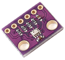
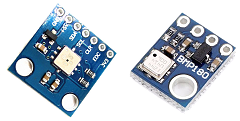
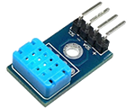
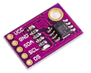
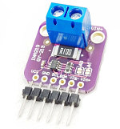
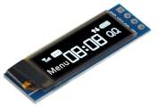

## Raspberry Pi用I2C汎用ライブラリ<!-- omit in toc -->

[Home](https://oasis3855.github.io/webpage/) > [Software](https://oasis3855.github.io/webpage/software/index.html) > [Software Download](https://oasis3855.github.io/webpage/software/software-download.html) > ***rpi-i2c*** (this page)

 
 

Last Updated : Nov. 2018

- [ソフトウエアのダウンロード](#ソフトウエアのダウンロード)
- [気圧・気温センサー BMP280, BME280](#気圧気温センサー-bmp280-bme280)
- [気圧・気温センサー BMP085, BMP180](#気圧気温センサー-bmp085-bmp180)
- [気温・湿度センサー DHT12](#気温湿度センサー-dht12)
- [気温センサー LM75A](#気温センサー-lm75a)
- [電流センサー INA219](#電流センサー-ina219)
- [ビットマップLCD SSD1306](#ビットマップlcd-ssd1306)
- [EEPROM Microchip 24LCxx](#eeprom-microchip-24lcxx)
- [ライセンス](#ライセンス)

 
 

## ソフトウエアのダウンロード

-  [このGitHubリポジトリを参照する（ソースコード）](./)

***各センサーIC名のディレクトリよりダウンロードする***

## 気圧・気温センサー BMP280, BME280

BME280は湿度センサーあり
- 気圧 300 〜 1100 hPa ± 1 hPa
- 気温 -40 〜 +85 ℃ ± 1 ℃
- 電源電圧 Vdd 1.8 〜 3.6 V
- 測定時最大電流 720 〜 1120 μA
- I/F I2CおよびSPI 

## 気圧・気温センサー BMP085, BMP180

BMP085とBMP180はプログラム互換
- 気圧 300 〜 1100 hPa ± 1 hPa
- 気温 -40 〜 +85 ℃ ± 0.1 ℃
- 電源電圧 Vdd 1.8 〜 3.6 V
- 測定時最大電流 650 〜 1000 μA
- I/F I2C 

## 気温・湿度センサー DHT12

- 湿度 20 〜 95 % ± 5 %
- 気温 -20 〜 +60 ℃ ± 0.5 ℃
- 電源電圧 Vdd 2.7 〜 5.5 V
- 測定時最大電流 800 μA
- I/F I2C 

## 気温センサー LM75A

- 気温 -55 〜 +125 ℃ ± 2 ℃
- 電源電圧 Vdd 2.8 〜 5.5 V
- 測定時最大電流 1000 μA
- I/F I2C 

## 電流センサー INA219

- シャント抵抗0.1Ω（R100）
- 電流値 0 〜 ±3.2A ＠ 0 〜 ±320mA
- 電源電圧 Vs 3 〜 5.5 V
- I/F I2C

※バス電圧（VBUS）の使いみちがわからない
※測定対象とRPiがアイソレートされていないので、GNDを相互接続するか、片側を電池駆動などで浮かせる必要がある 

## ビットマップLCD SSD1306

- 画面 OLED, pixel 128x32(0.91inch)または128x64(0.96inch)
- 電源電圧 Vs 3 〜 5.5 V
- I/F I2C 

## EEPROM Microchip 24LCxx

- 24LC32/64/128/256/512

## ライセンス

このプログラムは [GNU General Public License v3ライセンスで公開する](https://gpl.mhatta.org/gpl.ja.html) フリーソフトウエア

